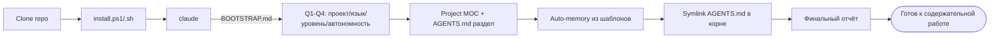

# claude-knowledge-base

> Переносимая методология ведения базы знаний в Obsidian + работы над проектами через Claude Code (или совместимый AI-агент).

[](https://github.com/klimG95/claude-knowledge-base/releases)
[](LICENSE)
[](#quick-start)
[](https://claude.com/claude-code)

## Что это

`claude-knowledge-base` — это не библиотека и не плагин, а **методология** работы AI-агента с проектом. Пакет даёт vault-скелет, шаблоны страниц, конституцию для агента (`AGENTS.md`), playbook (`AGENT-MANUAL.md`) и bootstrap-промт. Всё это упаковано в self-contained git-репо и разворачивается одной командой.

В основе — концепция «второго мозга»: vault выступает операционным центром между сессиями. Агент перед началом работы читает MOC (map of content) → переходит по [[wikilinks]] к нужным domain hub / runbook / ADR → получает контекст и принимает решения. Сам код проекта при этом остаётся источником правды про «как сейчас», а vault — про «почему так».

Память агента разделена на три слоя. **Semantic** — стабильные факты и принципы (vault: концепции, ADR, runbook'и, contracts). **Procedural** — авто-память (`~/.claude/projects/.../memory/MEMORY.md`), preferences, persistent инструкции пользователя. **Episodic** — журнал сессий (`vault/journal/`), incident-log, raw-выгрузки до обработки. Каждый слой имеет свой жизненный цикл и свои правила обновления.

Каждая страница vault — agent-first. Это значит: TL;DR в первых строках, декларативный стиль (что делать, не как), inline-ссылки на конкретные файлы/строки кода через wiki-style `[[file#section]]`, frontmatter с типом страницы и тегами для Dataview-индексов. Five page types: **concept** (доменная сущность), **reference** (как-делать), **contract** (wire/API), **domain-hub** (точка входа в подсистему), **inventory** (карта кода).

Над крупными задачами агенты работают параллельно по waves. Один файл — один агент. Конфликтов нет. После каждой wave — reviewer pass + объединение в общий результат. Паттерн доказан на проекте из 52 vault-страниц.

## Workflow



Flow короткий: `git clone` → запуск installer'а (PowerShell или bash) → `claude` в install-dir → первый промт «Прочитай BOOTSTRAP.md и приступай». Дальше Claude сам ведёт интерактив: 4 коротких вопроса про проект, язык общения, уровень пользователя и режим автономности — и на этом основании создаёт project-specific MOC, дописывает раздел в `AGENTS.md`, копирует auto-memory из шаблонов, ставит symlink конституции в корень репо проекта. По итогу — финальный отчёт «что сделано / что осталось» и переход к содержательной работе.

## Кому полезно

- Тем, кто работает с Claude Code на проекте дольше одной сессии и устал каждый раз восстанавливать контекст.
- Тем, кто хочет AI-агента в режиме «коллеги-аналитика», а не «справочника» — чтобы агент сам понимал scope, читал нужные страницы и принимал технические решения.
- Тем, кто ведёт коммерческий/предрелизный проект, где важна agent-friendly документация: ADR пережил три переписывания кода, а runbook отработал инцидент в 03:00.
- Тем, кто уже использует Obsidian и хочет связать vault с AI-агентом без vendor lock-in.

## Структура пакета

```
claude-knowledge-base/
├── README.md, INSTALL.md, LICENSE, VERSION, CHANGELOG.md   ← project-level
├── BOOTSTRAP.md                                            ← промт первой сессии Claude
├── AGENT-MANUAL.md                                         ← полный playbook агента
├── install.ps1, install.sh                                 ← cross-platform installers
├── smoke-test.ps1                                          ← верификация
│
├── obsidian-aura/                                          ← пустой vault, готовый к работе
│   ├── AGENTS.md                                           ← generalized конституция
│   ├── index.md, CHANGELOG.md                              ← заготовки
│   ├── raw/, journal/                                      ← пустые
│   └── wiki/
│       ├── methodology-overview.md
│       ├── runbook-session-start.md, runbook-session-handoff.md
│       └── templates/                                      ← 9 шаблонов страниц
│           ├── template-adr.md, template-incident.md,
│           ├── template-runbook.md, template-weekly-review.md
│           └── template-component.md, template-reference.md,
│               template-contract.md, template-domain-hub.md,
│               template-inventory.md
│
├── auto-memory-templates/                                  ← 6 .example файлов + README
│
├── claude-settings/                                        ← базовый профиль разрешений
│   ├── settings.json.example                               ← → .claude/settings.json
│   └── README.md                                           ← что можно и чего нельзя в allow
│
└── docs/
    ├── concepts.md          ← 3 слоя памяти, ADR, MOC, inventory, domain-hub
    ├── workflows.md         ← типичные сценарии
    ├── customization.md     ← кастомизация vault под проект
    ├── permissions.md       ← как убрать подтверждения, ничего не открыв лишнего
    └── troubleshooting.md
```

Имя папки `obsidian-aura/` — историческое (пакет выжат из реального проекта); при желании можно переименовать после установки, vault-скелет от имени не зависит.

## Quick start

```bash
# Clone
git clone https://github.com/klimG95/claude-knowledge-base.git
cd claude-knowledge-base

# Install (Windows PowerShell)
.\install.ps1 -CopyMemory -CopySettings

# Install (macOS / Linux)
./install.sh --copy-memory --copy-settings

# Запустить Claude в этой папке
claude

# Первый промт
> Прочитай BOOTSTRAP.md и приступай.
```

Флаг `-CopyMemory` / `--copy-memory` копирует `.example`-файлы из `auto-memory-templates/` в `~/.claude/projects/<encoded-path>/memory/` с автоматической генерацией encoded-пути — ручное кодирование пути не нужно.

Флаг `-CopySettings` / `--copy-settings` разворачивает базовый профиль разрешений в `.claude/settings.json`: правки файлов перестают спрашивать подтверждение, read-only командлеты разрешены. Профиль намеренно узкий — что в нём есть и чего в нём не будет никогда, см. [claude-settings/README.md](claude-settings/README.md).

После bootstrap-сессии vault настроен под твой проект: создан project-specific MOC, обновлён `AGENTS.md`, проставлены auto-memory указатели. Дальше — обычная работа.

Полная инструкция — [INSTALL.md](INSTALL.md).

## Принципы

- **Vault — источник истины про «почему», код — про «как сейчас».** Не дублируй в vault то, что есть в коде. Ссылайся через `[[file#section]]`.
- **Связывай страницы двусторонне.** Если A ссылается на B, B должна иметь backlink на A. Dataview-индексы строятся на этом.
- **Декларативность.** Страница говорит «что делать», а не «как именно». Конкретику агент возьмёт из кода/прежних сессий.
- **ADR пережил много переписываний кода — это фича, не баг.** Решение фиксируется в vault на уровне контекста и trade-off'ов, а не на уровне сигнатур функций.
- **Один файл — один агент.** При параллельной работе агентам выдаются непересекающиеся файлы. Reviewer-pass объединяет.
- **TL;DR в первых строках.** Любая страница должна быть полезна агенту даже при чтении первых 10 строк.
- **Против подтверждений сначала меняй инструмент, а не права.** Read/Grep/Glob не спрашивают вообще; правило в `settings.json` сопоставляется по префиксу строки и не разбирает флаги, поэтому широкое правило открывает больше, чем кажется. Подробно — [docs/permissions.md](docs/permissions.md).

## Versioning

Semver. См. [CHANGELOG.md](CHANGELOG.md) для истории релизов. Tags на GitHub: [Releases](https://github.com/klimG95/claude-knowledge-base/releases).

## Лицензия

MIT — см. [LICENSE](LICENSE). Copyright 2026 klimG95.

## История

Методология разработана в рамках реального предрелизного проекта 2026-05. Полная structural documentation паттерна (ADR-006-стиль) применена и доказала свою работоспособность на проекте из 52 vault-страниц. Этот пакет — generalize-выжимка: убраны project-specific детали, оставлены переносимые шаблоны и playbook.

## Связано

- [INSTALL.md](INSTALL.md) — установка
- [BOOTSTRAP.md](BOOTSTRAP.md) — первая сессия Claude
- [AGENT-MANUAL.md](AGENT-MANUAL.md) — полный playbook для агента
- [CHANGELOG.md](CHANGELOG.md) — история релизов
- [docs/concepts.md](docs/concepts.md) — концепции методологии
- [docs/workflows.md](docs/workflows.md) — типичные сценарии
- [docs/customization.md](docs/customization.md) — кастомизация под проект
- [docs/permissions.md](docs/permissions.md) — подтверждения: замер, безопасные правила, что нельзя
- [claude-settings/README.md](claude-settings/README.md) — базовый профиль разрешений
- [docs/troubleshooting.md](docs/troubleshooting.md) — частые проблемы
