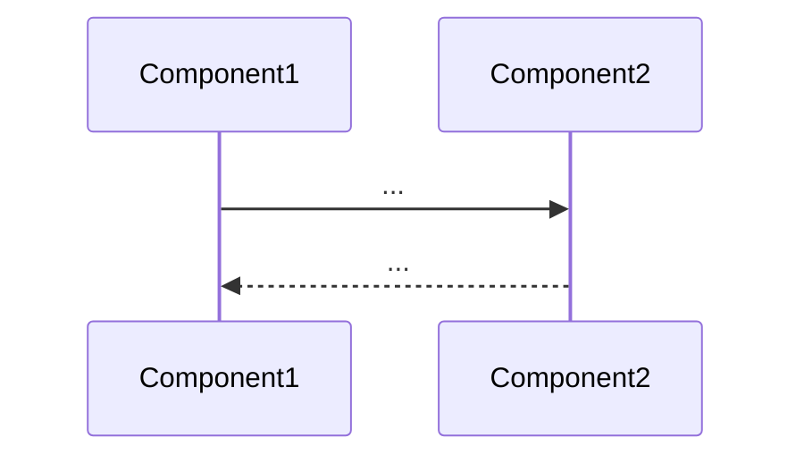

# <Domain name>

**TL;DR.** <2-4 строки: что такое этот сквозной домен, в каких компонентах живёт, какие основные вопросы решает.>

## Когда читать эту страницу

- При вопросе «как работает <domain> end-to-end».
- При инциденте, затрагивающем несколько компонентов в этом домене.
- Перед изменением, влияющим на flow между компонентами.

## End-to-end flow

<Краткое описание потока в 3-5 шагов.>

## Участники

| Компонент | Роль в этом домене | Страница |
|-----------|---------------------|----------|
| <name>    | <producer/consumer/orchestrator/...> | [[<project>-...]] |

## Ключевые контракты

- [[<project>-contract-...]]

## Анти-паттерны / gotchas (сквозные)

1. <Что часто ломают на стыках компонентов в этом домене.>
2. <...>

## Связано с

- [[<project>]] — MOC проекта
- <минимум 5 двусторонних связей на компонентные подстраницы>

## Источник

<Briefing, ТЗ, ADR, существующие docs/.>
